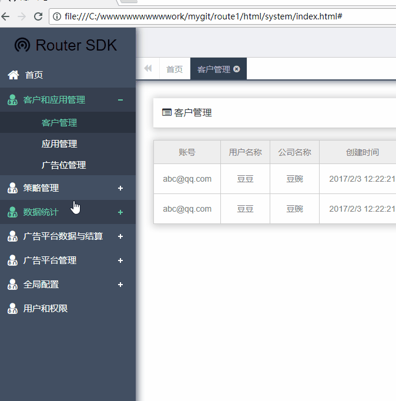

#SDK广告后台管理系统 (pc端)
 



```js

该项目主要用于给各大平台广告运营商管理广告的投放和用户而开发的，
该项目有客户和应用管理、策略管理、数据统计、广告平台数据与结算、
广告平台管理、热更新、全局配置、用户和权限等八个模块，
由于公司其他前端不熟练框架的使用，
所以该项目用古老的ifram标签搭建实现的单页面应用，
登录页用了MD5插件加密了登录名，
日期查询使用的easeUI里的日期插件，
数据的渲染使用的artTemplate模板引擎；
日志管理系统是用于查询SDK管理系统的日志信息，修改人员及修改时间等，
日志管理比较小，只有三个模块，用户查询，项目查询及日志查询等三个子模块；

```
